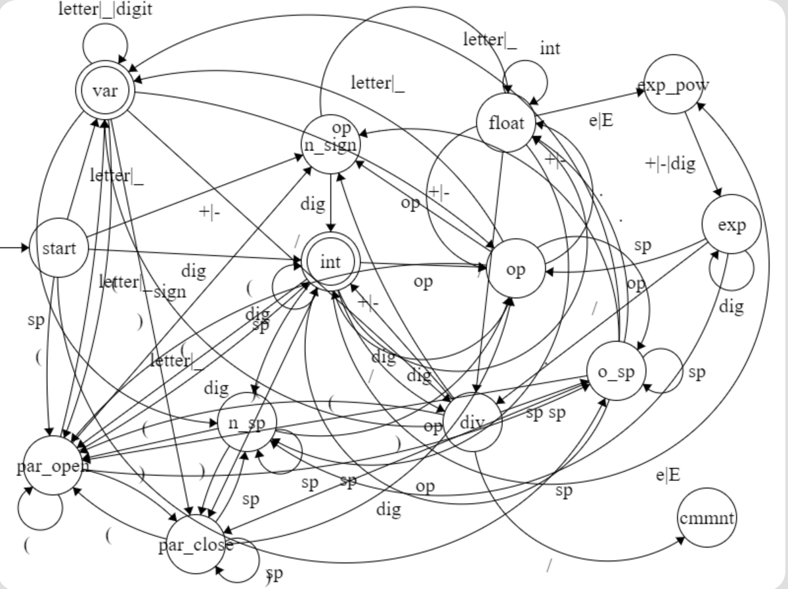

# Documentación del autómata

Miguel Arriaga - A01028570

Pablo Rocha - A01028638

Se realizó un automata capaz de reconocer tokens de expresiones aritméticas.

Los tipos de tokens que el autómata detecta son:

- Enteros
- Flotantes (Reales)
- Operadores:
  - Asignación
  - Suma
  - Resta
  - Multiplicación
  - División
  - Potencia
- Identificadores:
  - Variables
- Símbolos especiales:
  - (
  - )
- Comentarios:
  - // seguido de caracteres hasta que se acabe el renglón

## Diagrama de estados

Para generar el automata, primero se realizó un diagrama de estados.

 </img>

## Cómo correr

Para correr la función con un input personalizado (por ejemplo: d = a ^ b+5 // Esto es un comentario), se debe de llamar a través de los comandos:

`racket -it 02_token_type_dfa`

Y una vez dentro de la terminal de Racket:

`(arithmetic-lexer "d = a ^ b+5 // Esto es un comentario")`

Para correr los casos de prueba incluidos en el repositorio:

`racket -it 02_token_type_dfa`

Y una vez dentro de la terminal de Racket:

`(load "./test-cases/arithmetic-test-v4.rkt")`

## Lenguaje

El lenguaje que se utilizó para la creación de autómata fue Racket.

## Instalaciones requeridas

- Instalar racket:
    - https://download.racket-lang.org/